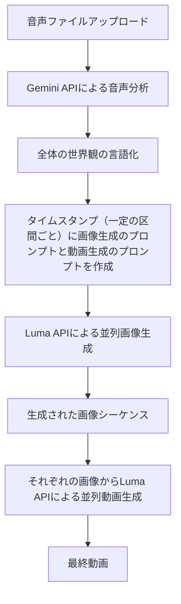

# 音声から動画生成システム

## システムフロー

## 処理フロー詳細

1. **音声ファイルアップロード**
   - ユーザーが音声ファイルをアップロード
   - 対応フォーマット: MP3, WAV, OGG

2. **Gemini APIによる音声分析**
   - 音声ファイルをタイムスタンプごとに分割（例: 30秒ごと）
   - 各セグメントをGemini APIに送信して分析

3. **タイムスタンプごとの分析結果**
   - 各タイムスタンプに対応する分析結果を取得
   - 音楽の変化に応じた世界観の変遷を捉える

4. **言語化された世界観と画像生成プロンプト**
   - 各タイムスタンプに対して:
     - 世界観の言語的説明（ストーリー、ビジュアル、感情）
     - 画像生成用の最適化されたプロンプト

5. **並列画像生成**
   - 各タイムスタンプのプロンプトから並列で画像を生成
   - Luma APIを使用して高品質な画像を生成

6. **画像シーケンスから動画生成**
   - 生成された画像シーケンスをLuma APIに送信
   - タイムスタンプに合わせて画像を配置
   - 滑らかな遷移効果を適用

7. **最終動画の生成**
   - 元の音声と生成された映像を合成
   - 最終的な動画ファイルを出力

## 技術スタック

- **フロントエンド**: React, TypeScript, Tailwind CSS
- **API**: 
  - Google Gemini API (音声分析、プロンプト生成)
  - Luma API (画像・動画生成)
- **データ処理**: Web Audio API (音声分析)